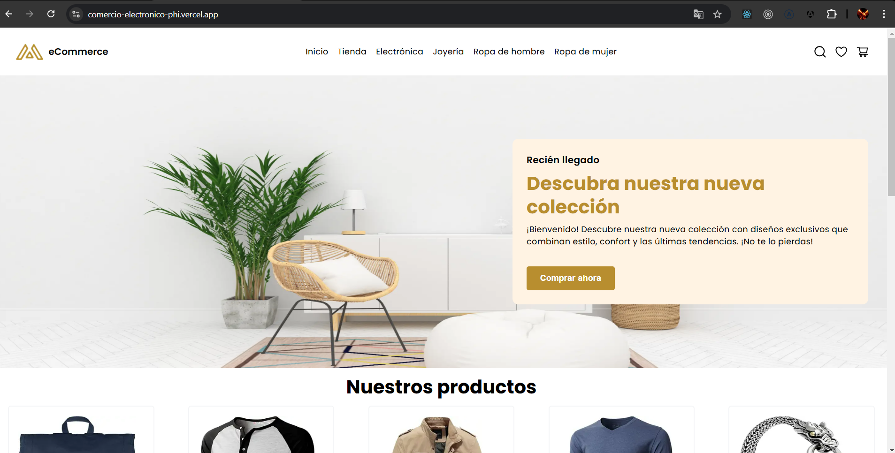
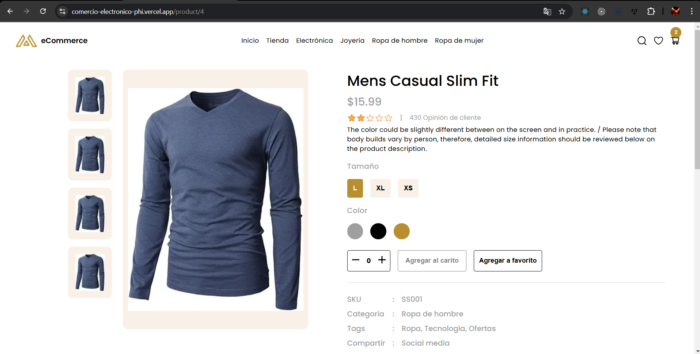
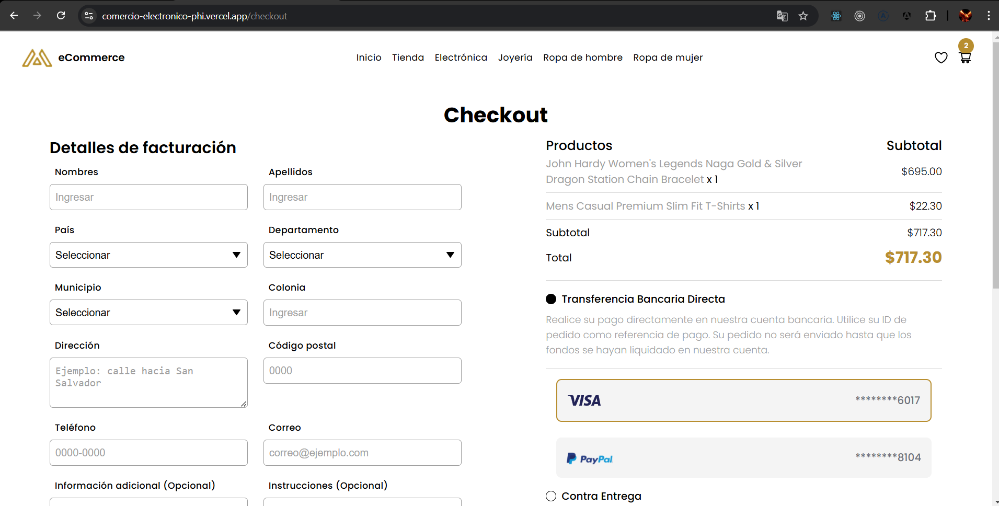

# Comercio Electrónico

Proyecto creado con [Next.js](https://nextjs.org) y [`create-next-app`](https://nextjs.org/docs/app/api-reference/cli/create-next-app).

## Comenzando

Primero, clona el repositorio en caso de tenerlo clonado usando el siguiente comando:

```bash
git clone https://github.com/GersonBenito/comercio-electronico.git
```

Segundo, ingresa en el proyecto clonado y instala las dependencias de Node js usando el siguiente comando:

```bash
npm i
# o
npm install
```

Tercero, ejecuta el servidor de desarrollo usando el comando que se encuentra en el archivo ``package.json`` en el nodo de ``scripts``:

```bash
npm run dev
```
Abre http://localhost:3000 en tu navegador para ver el resultado.

## Proyecto desplegado en [Vercel](https://vercel.com/)

Para visualizar el proyecto desplegado abre https://comercio-electronico-phi.vercel.app/





## Tecnologias usados


