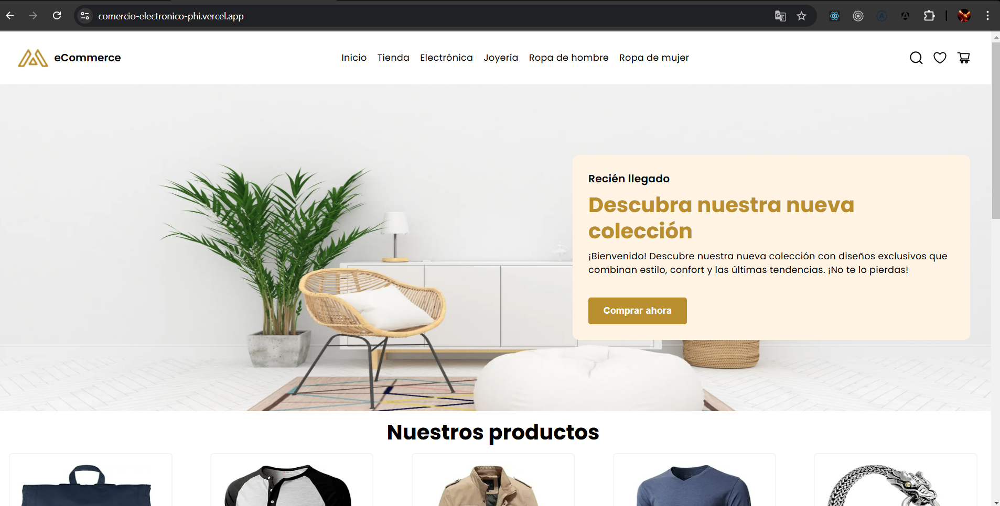
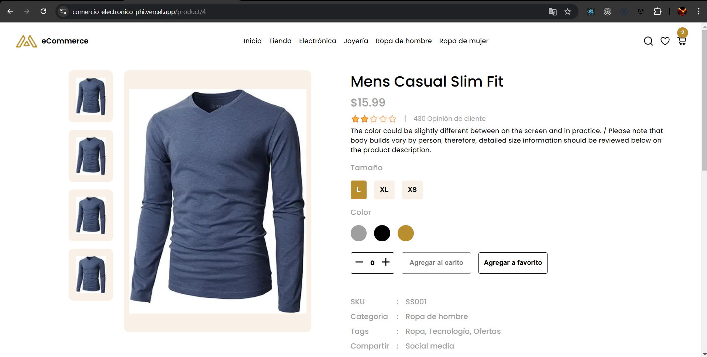
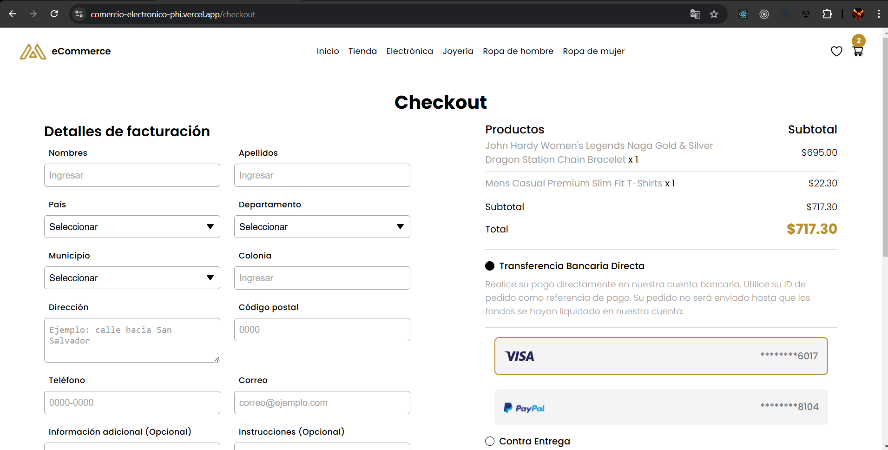

# Comercio Electrónico

Modern e-commerce storefront built with Next.js, TypeScript, and a clean component-based architecture. This project was designed to showcase a complete shopping experience, from browsing products to checkout and order confirmation, with a polished and responsive interface.

[](https://nextjs.org/)
[](https://www.typescriptlang.org/)
[](https://react.dev/)
[](https://zustand-demo.pmnd.rs/)
[](https://vercel.com/)

## Live demo

Explore the app here:

- Production: https://comercio-electronico-phi.vercel.app/

## Overview

This project simulates a real online retail experience with a catalog, product filtering, responsive shopping cart, validation-based checkout, and purchase flow. The app uses the App Router from Next.js and focuses on maintainable UI patterns, state management, and user-friendly interactions.

## Key features

- Product listing and category browsing
- Search functionality for products
- Product detail pages with image gallery and selection options
- Dynamic shopping cart with persistent state
- Quantity updates and total calculations
- Checkout form with validation using React Hook Form + Zod
- Order summary and success page
- Responsive UI for desktop and mobile screens
- Skeleton loading states and modern styling

## Tech stack

- Next.js 15
- React 19
- TypeScript
- Zustand for cart state management
- React Hook Form + Zod for form validation
- CSS Modules for component styling
- Vercel deployment

## Project structure

```bash
src/
├── app/
│   ├── (shop)/
│   │   ├── cart/
│   │   ├── checkout/
│   │   ├── product/
│   │   ├── products/
│   │   └── ...
│   └── layout.tsx
├── components/
├── config/
├── constants/
├── helpers/
├── hooks/
├── interfaces/
├── libs/
├── styles/
├── validations/
└── ...
```

## Getting started

### 1) Clone the repository

```bash
git clone https://github.com/GersonBenito/comercio-electronico.git
cd comercio-electronico
```

### 2) Install dependencies

```bash
npm install
```

### 3) Configure environment variables

Create a `.env.local` file in the root of the project based on `.envexample`:

```bash
API_URL='your_service_api_here'
```

For example, if you're using DummyJSON:

```bash
API_URL='https://dummyjson.com'
```

### 4) Run the app locally

```bash
npm run dev
```

Then open:

```bash
http://localhost:3000
```

## Available scripts

```bash
npm run dev     # Start the development server
npm run build   # Build the production app
npm run start   # Run the production build
npm run lint    # Check linting rules
```

## Screenshots

<div align="center">
  
  
  
</div>

## Notes

This project demonstrates a practical e-commerce UI and state-driven frontend architecture, making it a strong candidate for showcasing frontend development skills in a portfolio. It focuses on real-world patterns such as component reuse, local persistence, validation, and responsive design.

## License

This project is for educational and portfolio purposes.

## Contact

If you want to connect or discuss opportunities, feel free to reach out.